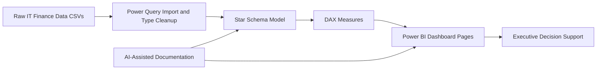

# Architecture Diagram

```mermaid
flowchart LR
    A[Raw IT Finance Data CSVs] --> B[Power Query Import and Type Cleanup]
    B --> C[Star Schema Model]
    C --> D[DAX Measures]
    D --> E[Power BI Dashboard Pages]
    E --> F[Executive Decision Support]
    G[AI-Assisted Documentation] --> C
    G --> E
```
